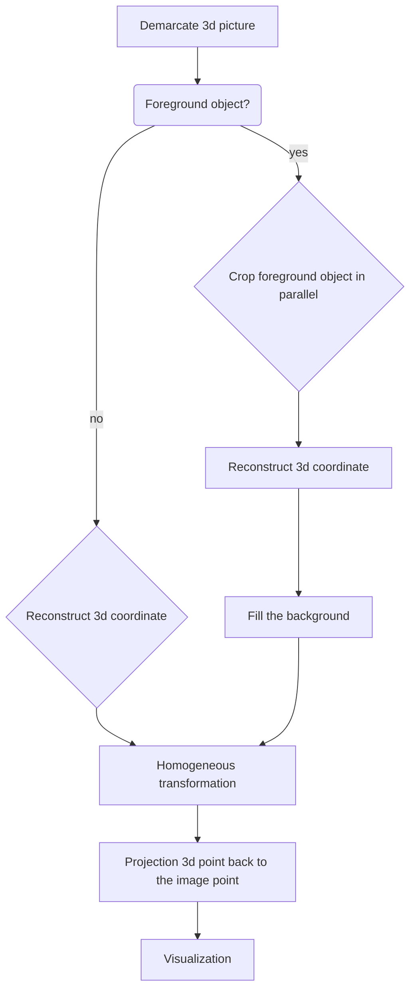

# Tour-Into-The-Picture

## Demo

https://user-images.githubusercontent.com/22386378/179780179-8f1c8389-f0b4-4ff0-9c4b-25f6dabf7ce4.mp4

## Introduction
* This project has made a program, which reconstruct the 3D information on a single 2D picture with simple annotation by user and later visualize it as a tour into the picture. The technique is described in [Tour Into the Picture](http://graphics.cs.cmu.edu/courses/15-463/2011_fall/Papers/TIP.pdf) by Horry et al.
* This project realizes 3D reconstruction of a picture,by vanishing point and bottom surface specify by user, it can also extract foreground objects separately
* use the camera toolbar to control the view

## Quick start

Please run `main.m` with the following step:

> 1. Choose the picture you are interested in
> 2. Frame a rectangle close to the center
> 3. Select a point within the rectangle you just outlined as the vanishing point
> 4. Select a foreground object model %You can also skip this step without selecting the foreground object
> 5. Click Start, you will see the 3d reconstructed picture, then use the camera toolbar to control the view
> 6. Click Reset, repeat step 1-5
> 7. Click Quit, close the program

Thank you for reading. Enjoy using it!

## Assumption

> 1. Every adjacent 3D rectangle mentioned above is orthogonal to the others.
> 2. The 3D rear wall is  parallel to the view plane
> 3. The 3D floor is orthogonal to the view up vector.
> 4. The textures of the 3D rectangles are inherited from those of the corresponding 2D rectangles.

## Workflow

## Algorithm
### Reconstruct 3D coordinate
Assume the vertical distance of one point on image to view plane equal to N pixels, then the 3D coordinate of every point on this image can be derived with the following mechanism:

### Homogeneous transformation
Now every point on image has its 3d coordinate, By changing the view, all the movement of the point can be dirived by Euclidian motion.
* The movement of the camera is described by a coordinate change of a fix point in space. It can be expressed by Euclidian motion.
* Euclidian motion by change in homogeneous coordinates:

### Projection 3d point back to the image point
With the formular below, we can project back the 3D coordinate back to 2D image

## Challenge
* How to proceed if bottom surface is not a rectangle
* How to handle the case, if bottom surface is not parallel to the view plane.

