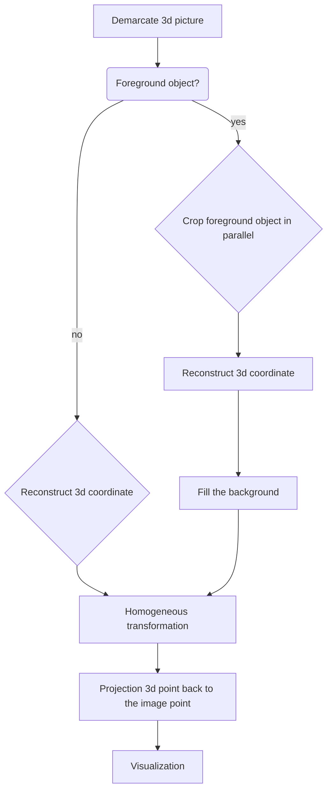

# Tour-Into-The-Picture

## Demo
https://user-images.githubusercontent.com/22386378/179718381-8ae9da2a-47e9-4f87-b901-11a22ccf388a.mp4
## Introduction
* This project has made a program, which reconstruct the 3D information on a single 2D picture with simple annotation by user and later visualize it as a tour into the picture. The technique is described in [Tour Into the Picture](http://graphics.cs.cmu.edu/courses/15-463/2011_fall/Papers/TIP.pdf) by Horry et al.
* This project realizes 3D reconstruction of a picture,by vanishing point and bottom surface specify by user, it can also extract foreground objects separately
* use the camera toolbar to control the view
## Workflow

## Quick start

Please run `main.m` with the following step:

> 1. Choose the picture you are interested in
> 2. Frame a rectangle close to the center
> 3. Select a point within the rectangle you just outlined as the vanishing point
> 4. Select a foreground object model %You can also skip this step without selecting the foreground object
> 5. Click Start, you will see the 3d reconstructed picture, then use the camera toolbar to control the view
> 6. Click Reset, repeat step 1-5
> 7. Click Quit, close the program

Thank you for reading. Enjoy using it!
